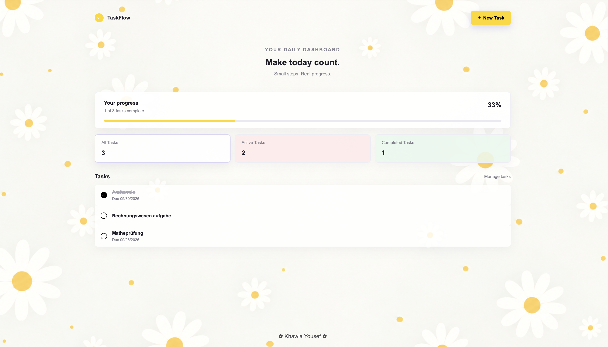
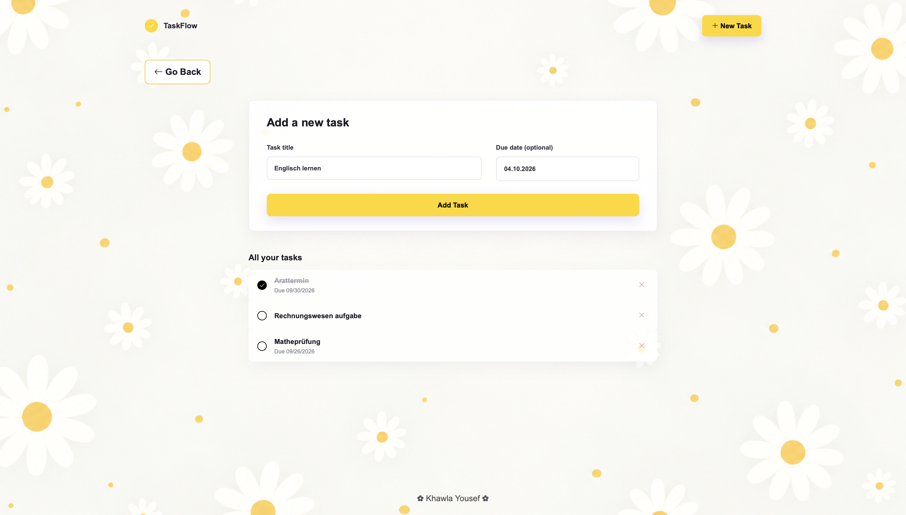
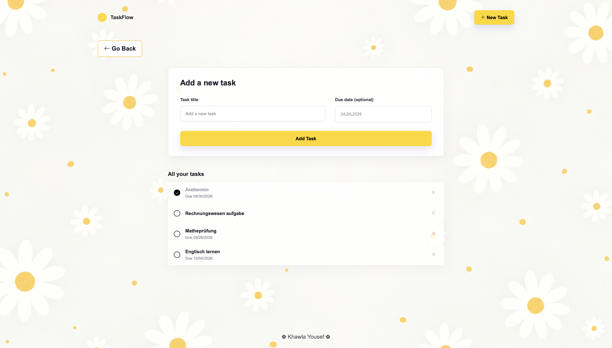

# 🌼 TaskFlow

TaskFlow ist eine einfache Anwendung zur Verwaltung von Aufgaben.

Mit der Anwendung können neue Aufgaben erstellt, optionale Fälligkeitsdaten festgelegt, Aufgaben als erledigt markiert und Aufgaben gelöscht werden. Auf der Startseite werden außerdem der aktuelle Fortschritt sowie die Anzahl der Aufgaben angezeigt.

TaskFlow wurde im Rahmen des WebTech-Moduls an der HTW Berlin entwickelt. Das Frontend wurde mit Angular umgesetzt. Die Aufgaben werden über ein Node.js-Backend in einer MongoDB-Datenbank gespeichert.

## 📸 Screenshots

### 🏠 Startseite

Die Startseite zeigt den Fortschritt sowie die Anzahl aller, aktiven und erledigten Aufgaben.



### ➕ Neue Aufgabe

Über das Formular kann eine neue Aufgabe mit einem optionalen Fälligkeitsdatum erstellt werden.



### 📋 Aufgabenübersicht

In der Aufgabenübersicht werden die gespeicherten Aufgaben angezeigt. Aufgaben können als erledigt markiert oder gelöscht werden.



## ✨ Funktionen

- Neue Aufgaben erstellen
- Optionales Fälligkeitsdatum hinzufügen
- Aufgaben als erledigt markieren
- Aufgaben löschen
- Fortschritt und Anzahl der Aufgaben anzeigen
- Aufgaben nach allen, aktiven und erledigten Aufgaben anzeigen
- Aufgaben dauerhaft in MongoDB speichern
- Responsive Benutzeroberfläche

## ⚙️ Installation

### Voraussetzungen

- Git
- Node.js und npm
- Angular CLI

Angular CLI kann bei Bedarf installiert werden:

```bash
npm install -g @angular/cli
```

### Frontend installieren und starten

Repository klonen:

```bash
git clone https://github.com/kyf12345678/WebTech26-Frontend.git
cd WebTech26-Frontend
```

Abhängigkeiten installieren:

```bash
npm install
```

Frontend starten:

```bash
ng serve
```

Die Anwendung ist anschließend unter `http://localhost:4200` erreichbar.

### Backend

Für die vollständige Funktion der Anwendung muss zusätzlich das Backend gestartet werden.

Das Backend befindet sich in einem eigenen Repository:

https://github.com/kyf12345678/WebTech26-Backend

Im Backend-Verzeichnis:

```bash
npm install
node server.js
```

Das Backend läuft standardmäßig auf Port `3000`.

Die API ist unter `http://localhost:3000/todos` erreichbar.

### Datenbank

TaskFlow verwendet MongoDB als Datenbank.

Die Verbindung zur Datenbank wird über eine `.env`-Datei im Backend konfiguriert.

Beispiel:

```env
DB_CONNECTION=YOUR_MONGODB_CONNECTION
DATABASE=taskflow
```

Die `.env`-Datei wird nicht in das Git-Repository hochgeladen.

## 🛠️ Technologien

### Frontend

- Angular
- TypeScript
- HTML
- CSS
- Bootstrap
- Bootstrap Icons

### Backend

- Node.js
- Express.js
- REST API

### Datenbank

- MongoDB
- Mongoose

## 🔄 CRUD-Funktionen

- **Create:** Neue Aufgabe erstellen
- **Read:** Aufgaben anzeigen
- **Update:** Aufgabe als erledigt markieren
- **Delete:** Aufgabe löschen

## 🤖 Verwendung von KI

Bei der Entwicklung von TaskFlow wurde Gemini als Unterstützung verwendet.

Gemini wurde verwendet für:

- Erklärungen zu Angular-, TypeScript- und Node.js-Konzepten
- Unterstützung bei Fehlersuche und Debugging
- Unterstützung bei der Projektstruktur
- Unterstützung bei der Dokumentation